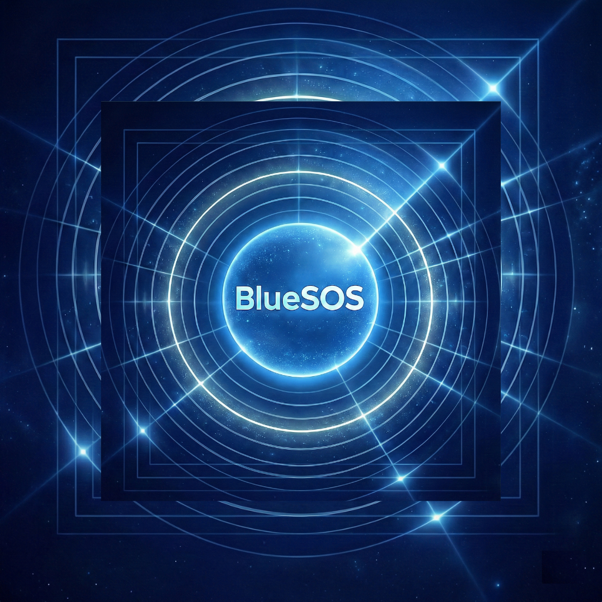
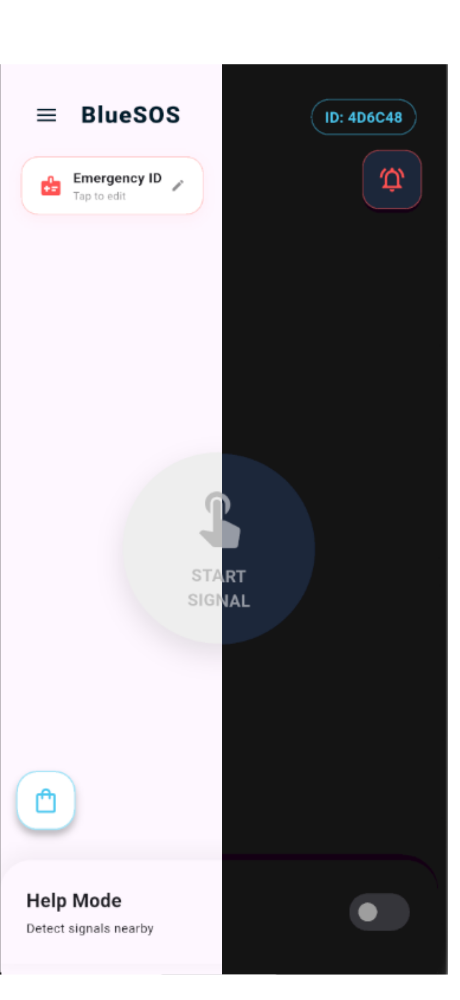
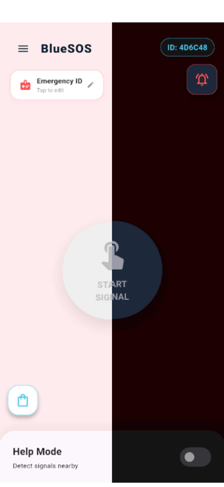
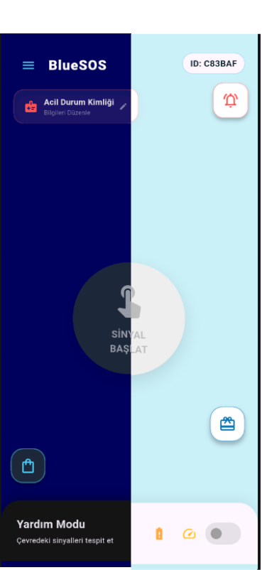

# 🔵 BlueSOS - Offline Emergency Radar & Personal Safety

<p align="center">
  
</p>

<p align="center">
  <strong>İnternet bağlantısı olmasa bile hayat kurtaran, Bluetooth LE tabanlı acil durum radar sistemi.</strong>
  <br />
  P2P iletişim protokolü ve gelişmiş kişiselleştirme özellikleriyle donatılmış kurumsal seviyede bir güvenlik çözümü.
</p>

<p align="center">
  
  
  
  
</p>

---

## 📱 Proje Hakkında

**BlueSOS**, internetin çekmediği veya acil müdahale gereken durumlarda yakın çevredeki kullanıcılarla iletişim kurmak için tasarlanmıştır. Uygulama, **Bluetooth Low Energy (BLE)** teknolojisini kullanarak cihazlar arasında bir "radar" oluşturur ve yardım sinyallerini anlık olarak yayınlar.

> 🔒 **Not:** Bu proje kapalı kaynaklıdır. Bu depo, projenin mimarisini, yeteneklerini ve kod standartlarını sergilemek amacıyla hazırlanmış bir portfolyo çalışmasıdır.

## 🎥 Uygulama Önizleme & Demo

Aşağıdaki bağlantı üzerinden Bluetooth radar özelliğinin ve acil durum sinyalizasyonunun çalışma prensibini izleyebilirsiniz:

[](https://www.youtube.com/watch?v=Zm0HXvl8aqA)

---

## ✨ Öne Çıkan Özellikler

* **📡 Çevrimdışı Radar:** İnternet bağlantısı gerekmeden yakındaki (BLE menzilindeki) cihazları tespit eder ve acil durum sinyali gönderir.
* **🆘 Güvenlik Araçları:** Tek dokunuşla siren, flaşör (meşale) ve dijital yardım sinyalini aktif hale getirir.
* **🎨 Gelişmiş Tema Motoru:** "Default", "Red" ve "Blue" gibi çoklu renk seçenekleri sunar. Tüm temalar **Dark Mode** ve **Light Mode** ile tam uyumludur.
* **🌍 Küresel Dil Desteği:** 20'den fazla dilde (İngilizce, Türkçe, Almanca, Arapça, Rusça, Çince vb.) tam yerelleştirme.
* **🔐 Supabase Altyapısı:** Kullanıcı profilleri ve veri senkronizasyonu için güvenli bulut entegrasyonu.

---

## 🏗️ Teknik Mimari ve Kod Snippet'ları

### 1. Dinamik Tema ve Mod Yönetimi
Uygulama, kullanıcı tercihlerine göre anlık olarak renk paletini ve modunu değiştiren merkezi bir `ThemeService` yapısına sahiptir.

```dart
// lib/theme_service.dart
// Default, Kırmızı ve Mavi temalar için Dark/Light mode uyumlu yönetim
class ThemeService with ChangeNotifier {
  // Tema modunu ve renk paletini (Default, Red, Blue) yöneten merkezi mantık
}
```

### 2. Bluetooth Radar (BLE) Mantığı
Cihazların birbirini bulması için `flutter_blue_plus` kütüphanesi ile optimize edilmiş tarama protokolü kullanılmıştır.

```dart
// lib/radar_screen.dart
// Çevredeki aktif acil durum sinyallerini tarama ve mesafe tahmini
void startRadarScan() {
  // Bluetooth LE kullanarak çevredeki sinyalleri yakalama protokolü
}
```

### 3. Çoklu Dil (L10n) Yapılandırması
Uygulama, yüksek ölçeklenebilirlik için `.arb` dosyaları üzerinden zengin bir dil kütüphanesi sunar:
`app_en.arb` (İngilizce), `app_tr.arb` (Türkçe), `app_de.arb` (Almanca), `app_ar.arb` (Arapça), `app_zh.arb` (Çince), `app_ru.arb` (Rusça) ve 15+ diğer dil.

---

## 🛠️ Teknoloji Yığını

* **Framework:** Flutter (Dart)
* **Veritabanı & Auth:** Supabase
* **Donanım Bağlantısı:** Bluetooth LE (P2P Discovery)
* **Yerel Servisler:** Bildirimler, Torch (El Feneri), Ses Yönetimi
* **Lokalizasyon:** Flutter Intl (.arb)

## 🖼️ Tema Görselleri

| Default Mode | Red Mode | Blue Mode |
| :---: | :---: | :---: |
|  |  |  |
| Modern ve Sade | Kritik Uyarı Odağı | Profesyonel Güvenlik |

## 📩 İletişim

**Onur Aba** 📧 [onuraba34@gmail.com](mailto:onuraba34@gmail.com)

---
*developed by Onur Aba*